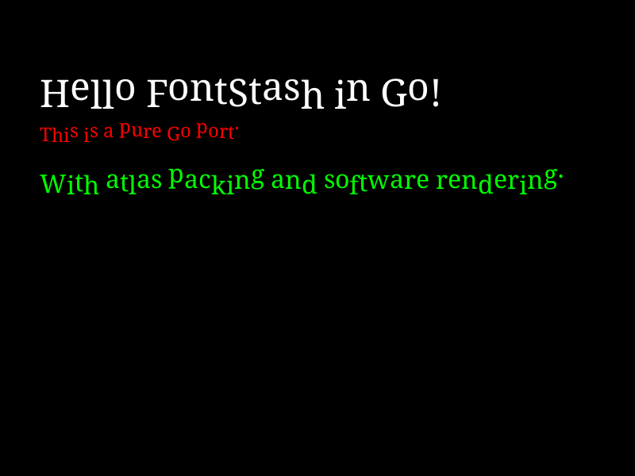

# Font Stash

Font Stash is a light-weight online font texture atlas builder written in Go. It is a pure Go port of the C library [fontstash](https://github.com/memononen/fontstash) by Mikko Mononen.

It uses `golang.org/x/image/font` and `golang.org/x/image/font/opentype` to render fonts on demand to a texture atlas, replacing the original `stb_truetype` dependency.

## Screenshot



This screenshot was generated by the example program in `cmd/example/`.

## Features

- Pure Go implementation (no Cgo).
- Uses standard Go font libraries.
- Immediate mode text rendering API.
- Texture atlas packing (Skyline Bin Packer).
- Backend agnostic (implement `Renderer` interface).
- Unicode support via Go's `rune`.

## Example

A complete runnable example with a software renderer (outputting to PNG) is available in [`cmd/example/`](cmd/example/).

To run the example:
```bash
go run cmd/example/main.go
```

### Basic Usage

```go
package main

import (
	"fmt"
	"image"
	"log"

	"github.com/yourname/fontstash/fontstash"
)

type MyRenderer struct {
	// ... backend specific fields (e.g. OpenGL texture ID)
}

func (r *MyRenderer) Resize(width, height int) {
	fmt.Printf("Resize atlas to %dx%d\n", width, height)
	// Create or resize texture
}

func (r *MyRenderer) Update(rect image.Rectangle, data []byte, imgWidth int) {
	fmt.Printf("Update atlas rect %v\n", rect)
	// Update texture subimage
}

func (r *MyRenderer) Draw(verts []fontstash.Vertex) {
	fmt.Printf("Draw %d vertices\n", len(verts))
	// Render triangles
}

func main() {
	fs, err := fontstash.New(fontstash.Params{
		Width:  512,
		Height: 512,
		Renderer: &MyRenderer{},
	})
	if err != nil {
		log.Fatal(err)
	}

	// Load font (returns index)
	fontNormal, err := fs.AddFont("sans", "DroidSerif-Regular.ttf")
	if err != nil {
		log.Fatal(err)
	}

	fs.SetFont(fontNormal)
	fs.SetSize(24.0)
	fs.SetColor(0xffffffff) // RGBA packed

	fs.DrawText(10, 10, "Hello Font Stash!")
}
```

## License
The library is licensed under [zlib license](LICENSE.txt).
